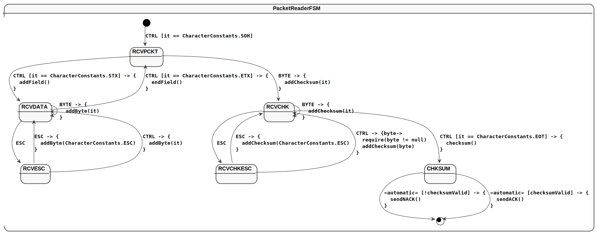
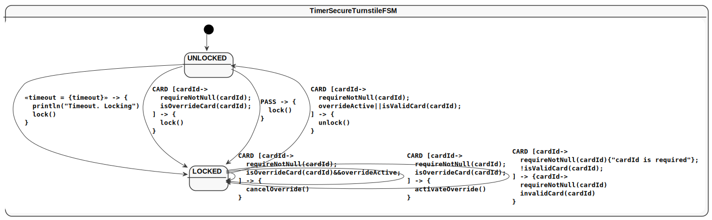

= KFSM Visualization Gradle Plugin

This work is licensed under link:https://www.apache.org/licenses/LICENSE-2.0.html[Apache License 2.0]

== Getting started

Plugin Id: io.jumpco.open.kfsm.viz-plugin
Version: 1.5.2.2

=== Gradle Groovy DSL
[source,groovy]
----
plugins {
    id 'io.jumpco.open.kfsm.viz-plugin' version '1.5.2.2'
}
----

== Configuration

=== Gradle Groovy DSL
[source,groovy]
----
kfsmViz {
  fsm('PacketReaderFSM') {
    input = file('src/main/kotlin/PacketReader.kt') // <1>
    isGeneratePlantUml = true // <2>
    isGeneratePlantUmlSimple = null // <3>
    isGenerateAsciidoc = true // <4>
    output = 'packet-reader' // <5>
    outputFolder = file('generated') // <6>
    plantUmlName = "packet-reader-state-diagram.plantuml" // <7>
    asciidocName = 'packet-reader-state-table.adoc'      // <8>
  }
}
----
<1> `input: File`: Required, fully qualified filename of relevant source file
<2> `isGeneratePlantUml: Boolean`: Required default is false
<3> `isGeneratePlantUmlSimple: Boolean`: Optional default is null
<4> `isGenerateAsciidoc: Boolean`: Required default is false
<5> `output: String`: Optional filename base. The default is the classname
<6> `outputFolder: File`: Optional directory for output file. Default is `$buildDir/generated`
<7> `plantUmlName: String`: Optional filename for plantuml output. Default is `$output.plantuml`
<8> `asciidocName: String`: Optional name of Asciidoc output file. Default is `$output.adoc`

=== Example for multiple FSM definitions
[source,groovy]
----
kfsmViz {
    fsm('PacketReaderFSM') {
        input = file('src/main/kotlin/PacketReader.kt')
        output = 'packet-reader'
        outputFolder = file('generated')
        isGeneratePlantUml = true
        isGenerateAsciidoc = true
    }
    fsm('TurnstileFSM') {
        input = file('src/main/kotlin/Turnstile.kt')
        output = 'turnstile'
        outputFolder = file('generated')
        isGeneratePlantUml = true
        isGenerateAsciidoc = true
    }
    fsm('TimerSecureTurnstileFSM') {
        input = file('TimeoutSecureTurnstile.kt')
        output = 'secure-turnstile'
        outputFolder = file('generated')
        isGeneratePlantUml = true
        isGenerateAsciidoc = true
    }
}
----

== Task

[source,bash]
----
./gradle :generateFsmViz
----

== Expected output

=== TurnstileFSM
==== Turnstile State Diagram
image:turnstile.svg[]

include::output/generated/turnstile.adoc[]

=== PacketReaderFSM
==== PacketReader State Diagram

include::output/generated/packet-reader.adoc[]

=== TimeoutSecureTurnstileFSM
==== TimeoutSecureTurnstile State Diagram

include::output/generated/secure-turnstile.adoc[]
